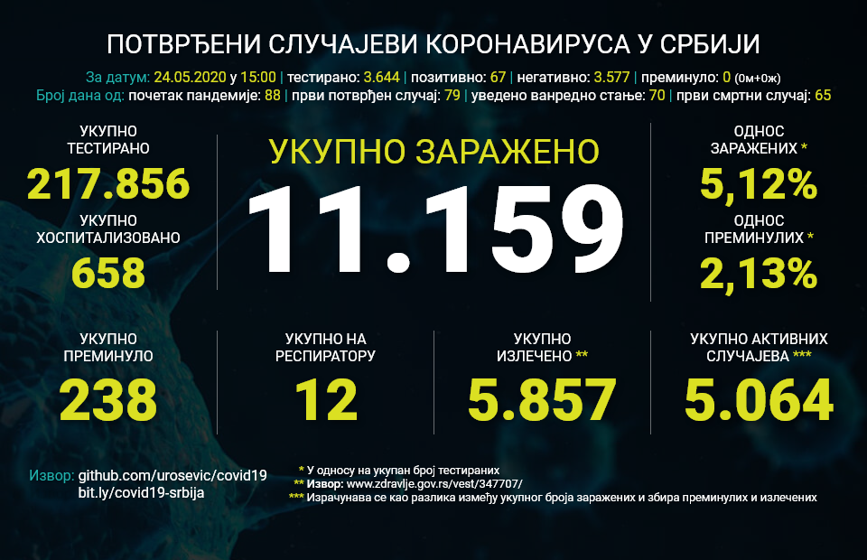

# covid19

Кумулативни отворени подаци о случајевима у току епидемије COVID-19 у Србији у JSON формату добијени процесирањем Гугл табеле https://bit.ly/covid19-srbija и прибављањем података доступних на https://covid19.data.gov.rs/ i https://data.gov.rs/sr/datasets/covid-19-zarazheni/



# Употреба

Ове податке можете слободно користити за своје пројекте, као што је то већ урадио @salebab за пројекат https://covid19.sorskod.com/

# Садржај

У овом репозиторијуму доступне су следеће датотеке:
* **covid19srbija.json** - Комплетни збирни подацима у вези са COVID-19 у Србији. Извор је Гугл табела https://bit.ly/covid19-srbija у којој су прикупљени подаци са https://covid19.rs/ и https://www.zdravlje.gov.rs/sekcija/345852/covid-19.php
* **covid19srbija-gradovi.json** - Укупан број оболелих од COVID-19 у Србији по градовима. Препаковани подаци са https://data.gov.rs/sr/datasets/covid-19-zarazheni/
* **covid19srbija-zarazeni-mesta.csv** - Препаковани подаци доступни на https://data.gov.rs/sr/datasets/covid-19-zarazheni/ о укупном броју заражених по свим местима у Србији у матрикс табелу у CSV формату. Користи се на https://docs.google.com/spreadsheets/d/1gT3aFebhafzvGfmIkEsBxT-vgPpr9UOnZDTAxnWP2U0/edit#gid=1501414670
* **poster/latest.png** - Визуелни постер са статистичким подацима за последње ажурирано стање података. Директоријум **poster/** садржи и постере за претходне дане почевши од 10. априла 2020

# Структура података

JSON датотека **covid19srbija.json** садржи датасет са комплетним подацима о оболелима од COVID-19 у Србији следеће структуре:

```
{
    "name": "COVID-19 Srbija Community Data",
    "description": "Подаци о случајевима у току епидемије COVID-19 у Србији",
    "homepage": "https://github.com/urosevic/covid19",
    "license": "ODC Open Database License (ODbL)",
    "author":
    {
        "name": "Александар Урошевић",
        "email": "urke.kg@gmail.com"
    },
    "source": "https://bit.ly/covid19-srbija",
    "updated": "YYYY-MM-DDTHH:MM:SS+02:00",
    "latest":
    {
        "date": "DD/MM/YYYY HH:MM",
        "totals":
        {
            "tested": 3560,
            "testedO": 3561,
            "confirmed": 900,
            "fatal": 23,
            "hospitalized": 584,
            "recovered": 42,
            "ventilator": 69,
            "caseP": "25.28",
            "fatalP": "2.56",
            "p0": 25,
            "vs": 16,
            "f0": 11
        },
        "details":
        {
            "positive": 115,
            "hospital": 0,
            "personal": 115,
            "negative": 362,
            "fatal": 7,
            "recovered": 0,
            "totalTested": 477
        },
        "info":
        {
            "refs": ["URL1", "URL2"],
            "note": "..."
        }
    },
    "data": [
    {
        "date": "DD/MM/YYY HH:MM",
        "totals":
        {
            "tested": 0,
            "testedO": 0,
            "confirmed": 0,
            "fatal": 0,
            "hospitalized": 0,
            "recovered": 0,
            "ventilator": 0,
            "caseP": "0.00",
            "fatalP": "0.00",
            "p0": 0,
            "vs": 0,
            "f0": 0
        },
        "details":
        {
            "positive": 0,
            "hospital": 0,
            "personal": 0,
            "negative": 0,
            "fatal": 0,
            "recovered": 0,
            "totalTested": 0
        },
        "info":
        {
            "refs": ["URL"],
            "note": "..."
        }
    }]
}
```

JSON датотека **covid19srbija-gradovi.json** садржи датасет са укупним бројем оболелих од COVID19 у Србији следеће структуре:

```
{
    "name": "COVID-19 Srbija City Community Data",
    "description": "Подаци о укупном броју оболелих у току епидемије COVID-19 у Србији по градовима",
    "homepage": "https://github.com/urosevic/covid19",
    "license": "ODC Open Database License (ODbL)",
    "author":
    {
        "name": "Александар Урошевић",
        "email": "urke.kg@gmail.com"
    },
    "source": ["https://bit.ly/covid19-srbija", "https://covid19.data.gov.rs/"],
    "updated": "YYYY-MM-DDTHH:MM:SS+02:00",
    "cities":
    {
        "0":
        {
            "name": "...",
            "data":
            {
                "YYYY-MM-DD":
                {
                    "value": 0,
                    "change": 0
                }
            },
            {
                "YYYY-MM-DD":
                {
                    "value": 0,
                    "change": 0
                }
            }
        },
        "1":
        {
            "name": "...",
            "data":
            {
                "YYYY-MM-DD":
                {
                    "value": 0,
                    "change": 0
                }
            },
            {
                "YYYY-MM-DD":
                {
                    "value": 0,
                    "change": 0
                }
            }
        }
    }
}
```
